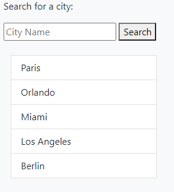

# weather-dashboard

## **Deployed Link**
Click on the following link to be re-directed to the live application: https://luccaloopz.github.io/weather-dashboard/

## **Contact Info**

* `Email:` luccamartins2012@gmail.com
* `GitHub Profile:` https://github.com/luccaloopz

## **languages Used**
* HTML
* CSS
* JavaScript

## **Description**
The purpose of this project is to create a weather dashboard that uses a weather API to retrieve weather data for a specific city around the world. When users search for a city, they are displayed with two separate blocks of information. The first block inludes the weather data for that city currently. The second block includes a 5-day forecast for the next 5 days.

## **Acceptance Criteria**
```
GIVEN a weather dashboard with form inputs
WHEN I search for a city
THEN I am presented with current and future conditions for that city and that city is added to the search history
WHEN I view current weather conditions for that city
THEN I am presented with the city name, the date, an icon representation of weather conditions, the temperature, the humidity, the wind speed, and the UV index
WHEN I view the UV index
THEN I am presented with a color that indicates whether the conditions are favorable, moderate, or severe
WHEN I view future weather conditions for that city
THEN I am presented with a 5-day forecast that displays the date, an icon representation of weather conditions, the temperature, and the humidity
WHEN I click on a city in the search history
THEN I am again presented with current and future conditions for that city
```

## **Application**

Basic functionality of the webpage:


A key part of the functionality of this application was the search bar/history section. As you can see below, once the user searches for a particular city, it is then populated within the search history list. The search history list therefore includes all of the cities that the user has searched for thus far. The search history persists across sessions. Meaning, if the page is reloaded, the search history list buttons will still be present and clicking on each of them will bring the user to that city's weather data once again.



## **License**

MIT License

Copyright (c) 2022 Lucca Martins

Permission is hereby granted, free of charge, to any person obtaining a copy of this software and associated documentation files (the "Software"), to deal in the Software without restriction, including without limitation the rights to use, copy, modify, merge, publish, distribute, sublicense, and/or sell copies of the Software, and to permit persons to whom the Software is furnished to do so, subject to the following conditions:

The above copyright notice and this permission notice shall be included in all copies or substantial portions of the Software.

THE SOFTWARE IS PROVIDED "AS IS", WITHOUT WARRANTY OF ANY KIND, EXPRESS OR IMPLIED, INCLUDING BUT NOT LIMITED TO THE WARRANTIES OF MERCHANTABILITY, FITNESS FOR A PARTICULAR PURPOSE AND NONINFRINGEMENT. IN NO EVENT SHALL THE AUTHORS OR COPYRIGHT HOLDERS BE LIABLE FOR ANY CLAIM, DAMAGES OR OTHER LIABILITY, WHETHER IN AN ACTION OF CONTRACT, TORT OR OTHERWISE, ARISING FROM, OUT OF OR IN CONNECTION WITH THE SOFTWARE OR THE USE OR OTHER DEALINGS IN THE SOFTWARE.